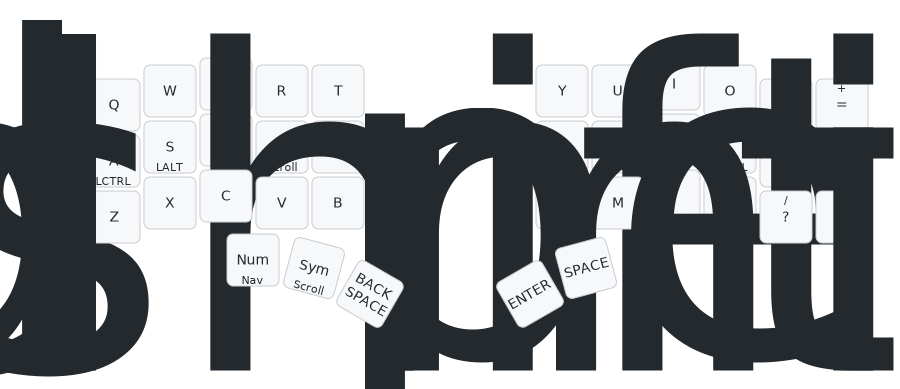

[](https://github.com/280Zo/charybdis-wireless-mini-zmk-firmware/actions/workflows/build.yml)

## Intro

This repository offers pre-configured ZMK firmware designed for [Wireless Charybdis keyboards](https://github.com/280Zo/charybdis-wireless-mini-3x6-build-guide?tab=readme-ov-file). It supports both Bluetooth/USB and Dongle configurations and uses the latest input listener and processors to act as a bridge between the trackball and the rest of the system.

If you want to customize things the repo is set up to build through GitHub Actions (just clone and run it), or you can use the
containerized build script that will build all firmwares locally with a single command.


## Quick Start

### Flashing the Firmware

Download your choice of firmware from the Releases page. Choose a combination of format (Bluetooth/Dongle) and layout (QWERTY, etc.), then follow the steps below to flash it to your keyboard

1. Unzip the firmware zip
2. Plug the right half into the computer through USB
3. Double press the reset button
4. The keyboard will mount as a removable storage device
5. Copy the applicable uf2 file into the NICENANO storage device (e.g. charybdis_qwerty_dongle.uf2 -> dongle)
6. It will take a few seconds, then it will unmount and restart itself.
7. Repeat these steps for all devices.
8. You should now be able to use your keyboard

> [!NOTE]  
> If you are flashing the firmware for the first time, or if you're switching between the dongle and the Bluetooth/USB configuration, flash the reset firmware to all the devices first

### Overview & Usage



To see all the layers check out the [full render](keymap-drawer/qwerty.svg).

⌨️ Keyboard Layers
| # | Layer      | Purpose                                                          |
| - | ---------- | ---------------------------------------------------------------- |
| 0 | **BASE**   | Standard typing with timeless home-row mods                      |
| 1 | **NUM**    | Combined digits + F-keys (tap for numbers, hold for functions)   |
| 2 | **NAV**    | Arrow keys, paging, TMUX navigation, mouse pointer               |
| 3 | **SYM**    | Symbols, punctuation, and a couple of helpers                    |
| 4 | **GAME**   | Gaming layer (just key-codes, no mods)                           |
| 5 | **EXTRAS** | Shortcuts, functions & snippets                                  |
| 6 | **MOUSE**  | Full mouse-key layer (pointer + wheel)                           |
| 7 | **SLOW**   | Low-speed pointer for pixel-perfect work                         |
| 8 | **SCROLL** | Vertical/Horizontal scroll layer                                 |

🏠 Home-Row Mods
| Side                | Hold = Modifier              | Tap = Letter / Key  |
| ------------------- | ---------------------------- | ------------------- |
| Left                | **Gui / Alt / Shift / Ctrl** | `A S D F`           |
| Right               | **Ctrl / Shift / Alt / Gui** | `J K L ;`           |


🔗 Combos
| Trigger Keys              | Result                                 |
| ------------------------- | -------------------------------------- |
| `K17 + K18`               | **Caps Word** (one-shot words in CAPS) |
| `K25 + K26`               | **Left Click**                         |
| `K26 + K27`               | **Middle Click**                       |
| `K27 + K28`               | **Right Click**                        |
| `K13 + K22`               | Toggle **MOUSE** layer                 |
| `K38 + K39` (thumb cluster)| Layer-swap **BASE ⇄ EXTRAS**           |


⚙️ Other Highlights
- **Timeless home row mods:** Based on [urob's](https://github.com/urob/zmk-config#timeless-homerow-mods) work and configured on the BASE layer with balanced flavor on both halves (280 ms tapping-term, and quick-tap with prior-idle tuning).
- **Thumb-scroll mode:** Hold the left-most thumb button (K36) while moving the trackball to turn motion into scroll.
- **Precision cursor mode:** Double-tap, then hold K36 to drop the pointer speed, release to return to normal speed.
- **Mouse-Click + Symbol-Layer - K37**
  - Tap: Left mouse click
  - Tap & Hold: Layer 3 (symbols) while the key is held
  - Double-Tap & Hold: holds the left mouse button
  - Tripple-Tap: Double mouse click
- **Backspace + Number-Layer - K38**
  - Tap: Backspace
  - Hold: Layer 1 (numbers) while the key is held
  - Double-Tap & Hold: Keeps Backspace held
- **Bluetooth profile quick-swap:** Jump to the EXTRAS layer and tap the dedicated BT-select keys to pair or switch among up to four saved hosts (plus BT CLR to forget all).
- **PMW3610 low power trackball sensor driver:** Provided by [badjeff](https://github.com/badjeff/zmk-pmw3610-driver)
  - Patched to remove build warnings and prevent cursor jump on wake
- **Hold-tap side-aware triggers:** Each HRM key only becomes a modifier if the opposite half is active, preventing accidental holds while one-handed.
- **Quick-tap / prior-idle:** Tuned for faster mod-vs-tap detection.
- **ZMK Studio:** Supported on BT builds for quick and easy keymap adjustments. Dongle support will come soon.


## Customize Keymaps, Layers, & Trackball

This section will help you personalize your firmware. Everything—from keys and layers to advanced trackball behaviors—can easily be customized, even if you're new to ZMK.

### Building Only Specific Keymaps or Shields

By default both Bluetooth and Dongle formats will build firmware pairs for the QWERTY, Coleman DH, and Graphite keymaps. To save time and streamline your builds, you can build just a single keymap or shield that you're interested in:

**Single keymap:**
Any `.keymap` files in the `config/keymap/` directory will be automatically built. By default QWERTY and Colemak DH are included, but you can add or remove as many as you'd like as long as there is at least one .keymap file to process.
Some additional keymaps are available in the extra-keymaps directory.

**Single shield format (Dongle or Bluetooth):**
Delete the shield directory (charybdis_dongle or charybdis_bt) from the config/boards/shields/ folder to build only the format you need.


### Modify Key Mappings

**ZMK Studio**

[ZMK Studio](https://zmk.studio/) allows users to update functionality during runtime. It's currently only implemented on the Bluetooth builds.

To change the visual layout of the keys, the physical layout must be updated. This is the charybdis-layouts.dtsi file, which handles the actual physical positions of the keys. Though they may appear to be similar, this is different than the matrix transform file (charybdis.json) which handles the electrical matrix to keymap relationship.

To easily modify the physical layout, or convert a matrix transform file, [caksoylar](https://github.com/caksoylar/zmk-physical-layout-converter) has built the [ZMK physical layouts converter](https://zmk-physical-layout-converter.streamlit.app/).

For more details on how to use ZMK Studio, refer to the [ZMK documentation](https://zmk.dev/docs/features/studio).

**Keymap GUI**

Using a GUI to generate the keymap file before building the firmware is another easy way to modify the key mappings. Head over to nickcoutsos' keymap editor and follow the steps below.

- Fork/Clone this repo
- Open a new tab to the [keymap editor](https://nickcoutsos.github.io/keymap-editor/)
- Give it permission to see your repo
- Select the branch you'd like to modify
- Update the keys to match what you'd like to use on your keyboard
- Save
- Wait for the pipeline to run
- Download and flash the new firmware

**Edit Keymap Directly**

To change a key layout choose a behavior you'd like to assign to a key, then choose a parameter code. This process is more clearly outlined on ZMK's [Keymaps & Behaviors](https://zmk.dev/docs/features/keymaps) page. All keycodes are documented [here](https://zmk.dev/docs/codes) page

Open the config/keymap/charybdis.keymap file and change keys, or add/remove layers, then merge the changes and re-flash the keyboard with the updated firmware.


### Modifying Trackball Behavior

The trackball uses ZMK's modular input processor system, making it easy to adjust pointer behavior to your liking. All trackball-related configurations and input processors are conveniently grouped in the `config/charybdis_pointer.dtsi` file. Modify this file to customize tracking speed, acceleration, scrolling behavior, and more—then rebuild your firmware.


### Building Your Customized Firmware

You can easily build your firmware locally or leverage GitHub Actions:

**Local Build (recommended for quick testing and debugging)**

Clone this repo, then run these commands from the repo root:
```sh
cd local-build
docker-compose run --rm builder
```
See the [local build README](local-build/README.md) for additional details, including how to enable USB logging in the builds.

**GitHub Actions**

- Fork or clone this repo
- Push your changes to your GitHub
- GitHub Actions automatically builds your firmware and publishes downloadable artifacts under the Actions tab.


### Troubleshooting

- If the keyboard halves aren't connecting as expected, try pressing the reset button on both halves at the same time. If that doesn't work, follow the [ZMK Connection Issues](https://zmk.dev/docs/troubleshooting/connection-issues#acquiring-a-reset-uf2) documentation for more troubleshooting steps.
- If you run into a bug or something’s not working, feel free to open an issue or submit a PR! Just keep in mind I'm not a developer, and this is a hobby project so I may not be able to fix everything.


## Credits

- [badjeff](https://github.com/badjeff)
- [eigatech](https://github.com/eigatech)
- [nickcoutsos](https://github.com/nickcoutsos/keymap-editor)
- [caksoylar](https://github.com/caksoylar/keymap-drawer)
- [urob](https://github.com/urob/zmk-config#timeless-homerow-mods)