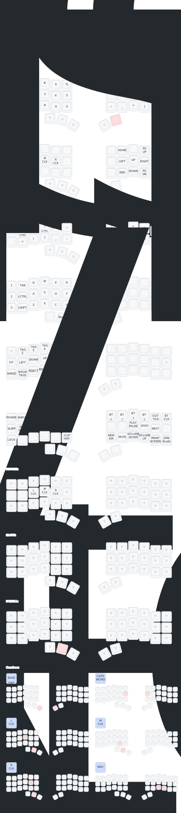

# Intro

This repository outlines most of the steps needed to build/modify the ZMK firmware for a Wireless Charybdis keyboard.

## Pre Built Firmware

If you'd like to skip all the configuration steps and use something prebuilt, the firmware files can be found in the [Actions Workflows](https://github.com/280Zo/charybdis-wireless-mini-zmk-firmware/actions?query=is%3Acompleted+branch%3Amain). Just log in, click the link, select the latest run that passed on the main branch, and download the 'firmware-charybdis-nanov2-qwerty' artifact (there's also a colemak dh firmware for those few that want to use that layout).
There are a few things to note about how I've chosen to configure things.

- The keyboard name is Charybdis. This is what will show up when you connect to it with bluetooth.
- ZMK has terms for each side of a split keyboard. Central is the half that sends keyboard outputs over USB or advertises to other devices over bluetooth. Peripheral is the half that will only send keystrokes to the central once they are paired and connected through bluetooth. I have chosen the right side as central because it fits my desk layout better.
- To add support for the PMW3610 sensor, [inorichi's driver](https://github.com/inorichi/zmk-pmw3610-driver?tab=readme-ov-file) is included in the firmware.
- Looking at different options to include support for mouse keys (move and scroll), there are several repos out there. [krikun98](https://github.com/krikun98/zmk/tree/mouse-pr) has one that looked promising, but ultimately I settled on [petejohanson's work](https://github.com/petejohanson/zmk/blob/feat/pointers-move-scroll/docs/docs/behaviors/mouse-emulation.md). This will be included in the prebuilt firmware until ZMK merges it.

### Keymaps & Layers

There is a lot that's going on with each layer, but the only things you need to know to get started are that the red keys are what to press to activate the layer, layer names are underlined, the BT keys on the EXTRAS layer allow you to select which bluetooth pairing you want, BT-CLR clears the pairing on the selected profile, and the Slow_Trkbl layer allows you to hold that button to slow the trackball movement down for more precision. As soon as you let it go the trackball movement goes back to normal.

Here is how each layer is mapped out for the latest firmware.

## Update Key Mappings

Before adding/updating a keymap, you need to select a behavior, then choose a parameter code that you plan to update the key to. This process is more clearly outlined on ZMK's [Keymaps & Behaviors](https://zmk.dev/docs/features/keymaps) page.
- Behaviors are all documented on the [Behaviors Overview](https://zmk.dev/docs/behaviors)
- Codes are all documented on the [keycodes](https://zmk.dev/docs/codes) page

There are a few options available to update the keymaps with the chosen behavior and code.

### Edit Code Directly

You can edit the keymap file directly to match any configuration you want by using the behavior and codes from above.

### Use a GUI

Using a GUI to generate the keymap file content is the easiest option. Head over to nickcoutsos' [keymap editor](https://nickcoutsos.github.io/keymap-editor/) and follow the steps below.

- Fork this repo
- Open a new tab to the keymap editor
- Give it permission to your fork
- Select the branch you'd like to modify
- Update the keys to match what you'd like to use on your keyboard
- Save
- Wait for the pipeline to run
- Download and flash the new firmware
  - Unzip the firmware.zip
  - Plug the right half info the computer through USB
  - Double press the reset button
  - The keyboard will mount as a removable storage device
  - Copy the right side uf2 file into the NICENANO storage device.
  - It will take a few seconds, then it will unmount and restart itself.
  - Plug in the left half, and copy the left uf2 file.
  - Both halves of the keyboard should now be flashed with the firmware.

## Building Your Own Firmware

ZMK provide a comprehensive guide to follow when creating a [New Keyboard Shield](https://zmk.dev/docs/development/new-shield). I'll touch on some of the points here, but their docs should be what you reference when you're building your own firmware.

### File Locations

The file locations for setting up the repo to build the firmware matters. The formats and locations of the files can be found on ZMK's [Configuration Overview](https://zmk.dev/docs/config). One thing to note about this repo is that the keymap and json files are in the config directory to work with a GUI keymapper. Also, the matrix-transform is included as part of the charbdis.dtsi file.

### Mapping GPIO Pins to Keys

To set up some of the configuration files it requires a knowledge of which keys connect to which pins on the MCU (see the [Shield Overlays](https://zmk.dev/docs/development/new-shield#shield-overlays) section), and how the rows and columns are wired.

To get this information, look at the PCB kcad files and follow the traces from key pads, to row and column through holes, to MCU through holes. Once you have that information you can update the shield.dtsi, shield_left.overlay, and shield_right.overlay files.

### Changing the Central and Peripheral Assignments

Follow the ZMK documentation to change the [Kconfig.deconfig](https://zmk.dev/docs/development/new-shield#kconfigdefconfig).

### Changing the Keyboard Name

Follow the ZMK [Kconfig.defconfig](https://zmk.dev/docs/development/new-shield#kconfigdefconfig) section to update the keyboard name. Make sure to read about the danger in exceeding the 16 character limit.

## Creating Graphical Key Maps

This repo uses the excellent work of caksoylar's [Keymap Drawer](https://keymap-drawer.streamlit.app/) to automatically generate a key mapping of each layer when the Github Actions are run.
 
## Upcoming ZMK Features

ZMK is actively being developed and there are a few features I'll be adding to my builds as soon as they are released.

- Mouse Pointer & Scrolling - [PR in review](https://github.com/zmkfirmware/zmk/pull/2027)
- Layer Locks - [Layer locks will hopefully get merged in](https://github.com/zmkfirmware/zmk/pull/1984)