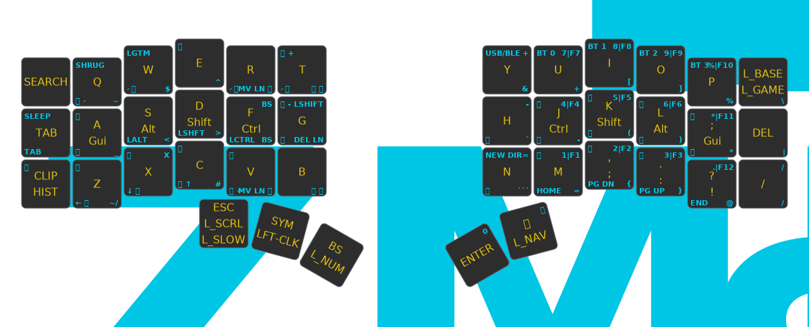
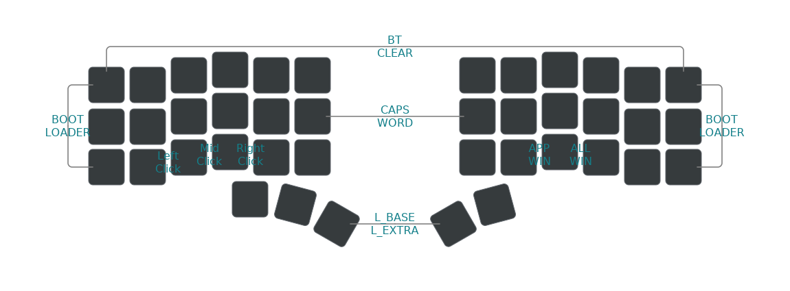
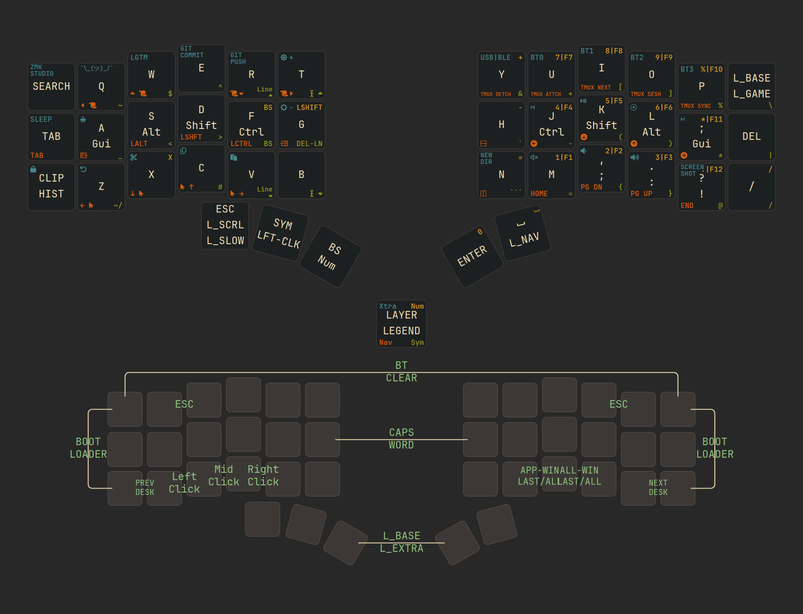

## Intro

This repository offers pre-configured ZMK firmware. It's designed for the [Wireless Charybdis keyboards](https://github.com/280Zo/charybdis-wireless-mini-3x6-build-guide?tab=readme-ov-file), but is easily adaptable to other platforms. It supports the latest stable ZMK release (v0.4.1) with full Bluetooth/USB split and dongle build support (including Prospector dongles with displays), and uses the latest input listeners and processors for responsive pointer and scroll behavior.

## Overview & Usage

<!-- 
 -->
<picture>
  <source media="(prefers-color-scheme: dark)" srcset="keymap-drawer/stacked/stacked-combos-dark.png">
  <source media="(prefers-color-scheme: light)" srcset="keymap-drawer/stacked/stacked-combos-light.png">
  
</picture>

To see all the layers check out the [full render](keymap-drawer/all_layers/all_layers.svg).

**Keyboard Layers**
| # | Layer      | Purpose                                                          |
| - | ---------- | ---------------------------------------------------------------- |
| 0 | **BASE**   | Standard typing with timeless home-row mods                      |
| 1 | **NUM**    | Combined digits + F-keys (tap for numbers, shift for functions)  |
| 2 | **NAV**    | Arrow keys, paging, TMUX navigation, mouse pointer               |
| 3 | **SYM**    | Symbols, punctuation, and a couple of helpers                    |
| 4 | **GAME**   | Gaming layer (just key-codes, no mods)                           |
| 5 | **EXTRAS** | Shortcuts, functions & snippets                                  |
| 6 | **MOUSE**  | Full mouse-key layer (pointer + wheel)                           |
| 7 | **SLOW**   | Low-speed pointer for precision pointer                          |
| 8 | **SCROLL** | Vertical/Horizontal scroll layer                                 |

**Home-Row Mods**
| Side                | Hold = Modifier              | Tap = Letter / Key  |
| ------------------- | ---------------------------- | ------------------- |
| Left                | **Gui / Alt / Shift / Ctrl** | `A S D F`           |
| Right               | **Ctrl / Shift / Alt / Gui** | `J K L ;`           |

**Combos**
| Trigger Keys              | Result                                  |
| ------------------------- | --------------------------------------  |
| `K17 + K18`                | **Caps Word** (one-shot words in CAPS) |
| `K25 + K26`                | **Left Mouse Button**                  |
| `K26 + K27`                | **Middle Mouse Button**                |
| `K27 + K28`                | **Right Mouse Button**                 |
| `K13 + K22`                | Toggle **MOUSE** layer                 |
| `K38 + K39` (thumb cluster)| Layer-swap **BASE / EXTRAS**           |

**Other Highlights**
- This repo now includes builds for the **[Prospector ZMK screen dongle](https://github.com/carrefinho/prospector)**.
  - Suppoert for the Nice!Nano v2 has been added to the firmware options.
  - The prospector case has been adapted in [OnShape](https://cad.onshape.com/documents/1ab8632c0729c14a80991694/w/0a5575e0aa91142d15642877/e/053f9ce9786904291254a911) to fit the Nice!Nano v2.
  Options are also available for the smaller APDS9960 ambient light sensor variant, and a lower-cost Waveshare non-touch screen option (SKU 24382)
- **Timeless-inspired home row mods:** Based on [urob's](https://github.com/urob/zmk-config#timeless-homerow-mods) work and configured on the BASE layer.
- **Thumb-scroll mode:** Hold the left-most thumb button (K36) while moving the trackball to turn motion into scroll.
- **Precision cursor mode:** Double-tap, then hold K36 to drop the pointer speed, release to return to normal speed.
- **K37 - Multifunction**
  - Tap: Left mouse click
  - Tap & Hold: Layer 3 (symbols) while the key is held
  - Double-Tap & Hold: holds the left mouse button
  - Tripple-Tap: Double mouse click
- **K38 - Multifunction**
  - Tap: Backspace
  - Hold: Layer 1 (numbers) while the key is held
  - Double-Tap & Hold: Keeps Backspace held
- **Bluetooth profile quick-swap:** Jump to the EXTRAS layer and tap the dedicated BT-select keys to pair or switch among up to four saved hosts (plus BT CLR to forget all).
- **PMW3610 low power trackball sensor driver:** Provided by [badjeff](https://github.com/badjeff/zmk-pmw3610-driver)
  - Patched to prevent cursor jump on wake
- **Hold-tap side-aware triggers:** Each HRM key only becomes a modifier if the opposite half is active, preventing accidental holds while one-handed.
- **Quick-tap / prior-idle:** Tuned for faster mod-vs-tap detection (160 / 120 ms), with tap-preferred variants on A, I, and O (positions 13, 21, and 22) for faster rolls in Colemak-DH.
- **ZMK Studio:** Supported on Bluetooth and the standard no-screen dongle builds for quick keymap adjustments. Prospector screen builds disable it to preserve RAM.

## Flash the Firmware

Download your choice of firmware from the Releases page. Choose a combination of format (Bluetooth/Dongle) and layout (QWERTY, etc.), then follow the steps below to flash it to your keyboard

1. Unzip the firmware bundle
2. One at a time, plug the devices into the computer through USB
3. Double press the reset button on the nice!nano
4. The keyboard will mount as a removable storage device
5. Copy the applicable uf2 file into the storage device
6. It will take a moment, then it will unmount and restart itself.
7. Repeat these steps for all devices.
8. If you've flashed one of the prospector dongle builds, you'll need to power on the dongle, then the left side before the right. This will sync the battery widget to the correct side.

> [!NOTE]
> If you are flashing the firmware for the first time, or if you're switching between the dongle and the Bluetooth/USB configuration, flash the reset firmware to all the devices first

## Customization

### Modify Key Mappings

**ZMK Studio**

[ZMK Studio](https://zmk.studio/) allows users to update functionality during runtime. It is supported on Bluetooth builds and the standard no-screen dongle build. For more details on how to use ZMK Studio, refer to the [ZMK documentation](https://zmk.dev/docs/features/studio).

> [!NOTE]
> Prospector screen builds disable ZMK Studio to preserve RAM and improve stability with the display stack.

**Edit Keymap Directly**

To change a key layout, choose a behavior you'd like to assign to a key, then choose a parameter code. This process is more clearly outlined on ZMK's [Keymaps & Behaviors](https://zmk.dev/docs/features/keymaps) page. All keycodes are documented [here](https://zmk.dev/docs/codes).

Modify the [qwerty.keymap](config/keymaps/qwerty.keymap) or one of the behaviors, combos, or macros in the [keymap_features](config/keymap_features) folder, then follow the instructions below to build and flash the firmware to your keyboard.

### Modifying Trackball Behavior

The trackball uses ZMK's modular input processor system, making it easy to adjust pointer behavior to your liking. All trackball-related configurations and input processors are conveniently grouped in the [charybdis_pointer.dtsi](config/trackball/charybdis_pointer.dtsi) file. Modify this file to customize tracking speed, acceleration, scrolling behavior, etc. Then rebuild your firmware.

### Modify Build Format Selection

Build formats are also selected in [build.yaml](build.yaml).

To change which firmware families are built:

1. Open [build.yaml](build.yaml)
2. Find the build entry or entries you want to keep
3. Comment out or remove the entries you do not want

The main build families are:

- `bt`: Bluetooth split builds
- `dongle_standard_nano`: the default no-screen dongle builds
- `dongle_prospector_*`: screen-enabled dongle builds using the Prospector adapter

For any of the Prospector dongle firmwares, there are additional customization options.

To change the Prospector layout:

1. Open [build.yaml](build.yaml)
2. Find the Prospector build entry you want
3. Replace the selected file under `extra_conf_files` with a different layout file from [config/dongle_prospector_layouts](config/dongle_prospector_layouts)

To change the Radii theme:

1. Select `dongle_prospector_layout_radii.conf` in `extra_conf_files`
2. Add one theme overlay from [config/dongle_prospector_themes](config/dongle_prospector_themes) to `extra_dtc_overlay_files`

### Modify Keymap Selection

Keymaps live in [config/keymaps](config/keymaps) and are selected in [build.yaml](build.yaml).

To change which keymaps are built:

1. Open [build.yaml](build.yaml)
2. Find the `keymap:` list under the build entry you have picked
3. Keep the keymaps you want and comment out or remove the others

### Build the Firmware

To build the firmware follow either of the build processes below:

**Local Build - Single Command**

1. Clone this repo
2. Update the config files to match your use case
3. Follow the instructions in the [local-build README](local-build/README.md)
4. Firmwares will be available in the firmwares folder

**Pipeline Build - GitHub Actions**

1. Fork this repo
2. Update the config files to match your use case
3. Push changes and confirm the workflows are running
4. Firmwares will be available in the action artifacts

## Credits

- [badjeff](https://github.com/badjeff) for the PMW3610 ZMK driver used as the basis for the trackball sensor integration
- [carrefinho](https://github.com/carrefinho) for the original [Prospector](https://github.com/carrefinho/prospector) hardware and the [Prospector ZMK module](https://github.com/carrefinho/prospector-zmk-module/tree/feat/new-status-screens) this repo adapts for Charybdis dongles
- [eigatech](https://github.com/eigatech) for prior Charybdis dongle work and useful reference patterns around split trackball/input-listener integration
- [nickcoutsos](https://github.com/nickcoutsos/keymap-editor) for the browser-based keymap editor workflow
- [caksoylar](https://github.com/caksoylar/keymap-drawer) for the keymap rendering workflow and physical layout conversion tooling
- [urob](https://github.com/urob/zmk-config#timeless-homerow-mods) for the timeless home-row mod approach this keymap builds on and the stacked layer SVG inspiration
